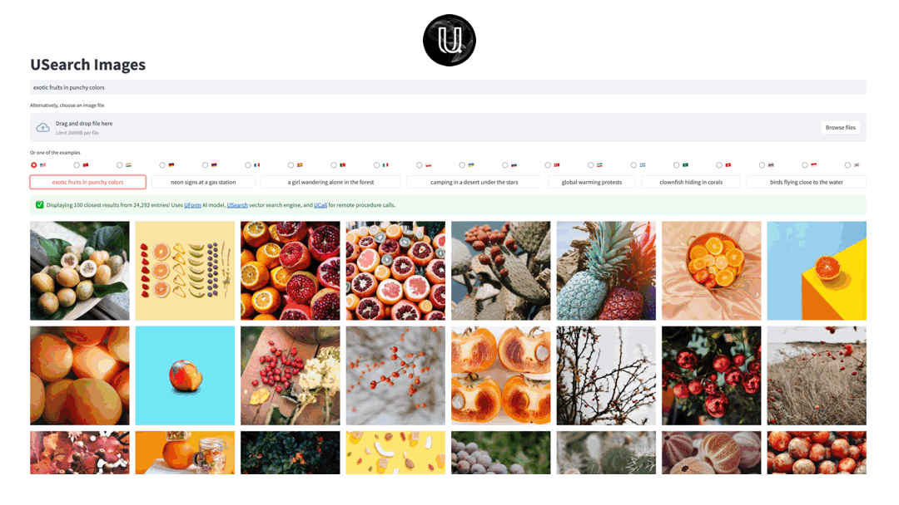

#  USearch Images



## Semantic Search Demo with [UForm][uform], [USearch][usearch], and [UCall][ucall]

- [x] Can run the GUI and the search part on the same or different server
- [x] Comes with pre-constructed indexes for large datasets
- [x] Supports text-to-image and image-to-image search

To start the StreamLit demo app locally, you need to download just a couple of files:

```sh
mkdir -p data/unsplash-25k
wget -O data/unsplash-25k/images.txt https://huggingface.co/datasets/unum-cloud/gallery-unsplash-25k/resolve/main/images.txt
wget -O data/unsplash-25k/images.uform-vl-multilingual-v2.fbin https://huggingface.co/datasets/unum-cloud/gallery-unsplash-25k/resolve/main/images.uform-vl-multilingual-v2.fbin

pip install -r requirements.txt
streamlit run streamlit_app.py
```

[uform]: https://github.com/unum-cloud/uform
[usearch]: https://github.com/unum-cloud/usearch
[ucall]: https://github.com/unum-cloud/ucall

## Datasets

The default dataset - Unsplash, contains less than 25'000 images.
Still, the demo is easy to extend to other datasets, some of which we already embedded with UForm and indexed with USearch.
All datasets are available on [Unum's HuggingFace page][unum-huggingface] and share an identical format:

- `images.txt` contains newline-delimited URLs or Base64-encoded data-URIs of images.
- `images.<model>.fbin` contains a binary matrix of [UForm][uform] embedding for every image from `images.txt`.
- `images.<model>.usearch` contains a binary [USearch][usearch] search index for fast kANN.

Additionally, some image-text paired datasets may provide `texts.txt`, `texts.<model>.fbin`, `texts.<model>.usearch`, following the same logic.

[unum-huggingface]: https://huggingface.co/unum-cloud
